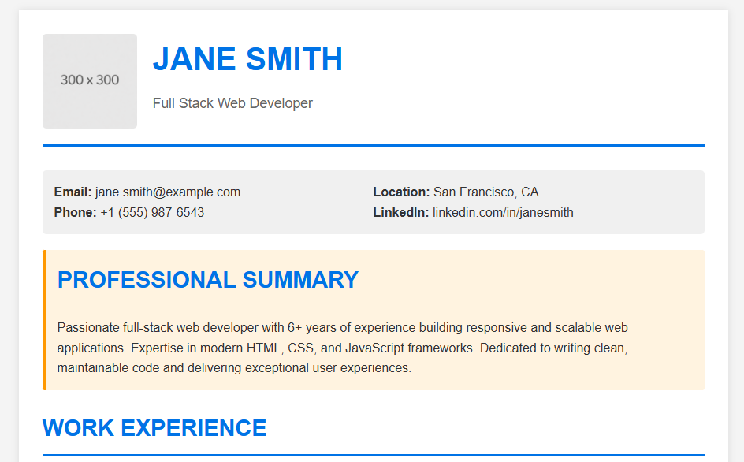

# HTML & CSS CV Demo

## Overview
This is a professional CV (Curriculum Vitae) created using **HTML and CSS** with a combination of external stylesheets, internal styles, and inline styling. The project demonstrates various CSS techniques including floating, positioning, and modern layout methods.

## Files Included
- **index.html** - Main HTML document with embedded styles and inline CSS
- **styles.css** - External CSS stylesheet
- **placeholderimage.png** - Profile photo (120px × 120px)
- **README.md** - This documentation file

## Screenshot
Below is a screenshot of the rendered CV 



## CSS Techniques Used

### 1. External CSS (styles.css)
- Global styles for the entire document
- Layout and spacing
- Color scheme and typography
- Responsive container design
- Box shadow and border effects
- Flexbox for skill items layout

### 2. Internal CSS (in <style> tag)
- Summary section with custom background and border
- Experience items with pseudo-elements (::before)
- Education section with relative positioning
- Custom styling for specific content sections

### 3. Inline CSS (style attribute)
- Contact information layout using Flexbox
- Profile image dimensions and object-fit
- Specific padding and margins
- Text alignment and colors
- Flex properties for responsive sections

## Key CSS Features Demonstrated

### Floating
- **Profile image**: Floated to the left in the header
- **Clear property**: Used to clear floats for clean separation between sections
- Classic float-based layouts for older browser support

### Positioning
- **Relative positioning**: Used for education items and project cards
- **Absolute positioning**: Used with pseudo-elements for bullet points
- **Position property**: Demonstrates relative positioning with offset values

### Modern CSS
- **Flexbox**: Used in contact info, skills list, and header layout
- **CSS Grid**: Referenced in skills section
- **Box-sizing**: Border-box for consistent sizing
- **Object-fit**: For proper image display

### Basic Properties
- **Margins & Padding**: Consistent spacing throughout
- **Border & Border-radius**: For visual separation
- **Background colors**: Different colors for sections
- **Text styling**: Font size, weight, color, and style variations
- **Box-shadow**: For depth effect on container

## Layout Structure

```
Container (max-width: 900px)
├── Header (with floating image)
├── Contact Info (Flexbox layout)
├── Professional Summary (custom internal CSS)
├── Work Experience (with positioning)
├── Education (positioned elements)
├── Technical Skills (Flexbox with skill items)
├── Featured Projects (positioned containers)
└── Footer
```

## How to Use

1. **Open the file**: Open `index.html` in any modern web browser
2. **View the styling**: Check how external, internal, and inline CSS work together
3. **Inspect elements**: Use browser DevTools to see the CSS properties
4. **Customize**: Edit the HTML and CSS files to match your information

## Customization

### Change Profile Image
Edit the image source in the `` tag:
```html

```

### Modify Colors
Update the color values in `styles.css`:
- Primary color: `#0073e6` (blue)
- Secondary color: `#ff9800` (orange)
- Background colors can be adjusted in both files

### Adjust Layout
- Modify `max-width` in `.container` for different viewport sizes
- Change `float` direction for different image placement
- Adjust `position` values for element positioning

## Browser Compatibility
This CV works in all modern browsers that support:
- CSS Flexbox
- CSS positioning
- Box-shadow
- Border-radius
- Float

## Best Practices Demonstrated

1. **Separation of Concerns**: External CSS for reusable styles
2. **DRY Principle**: Internal styles for section-specific styling
3. **Inline Styles**: For unique, one-off styling needs
4. **Semantic HTML**: Proper use of heading levels and structural elements
5. **Responsive Design**: Flexible layouts with media query considerations
6. **Color Contrast**: Readable text on background colors
7. **Consistent Spacing**: Unified margin and padding values

## Learning Outcomes

By studying this CV, you will learn:
- How to combine multiple CSS methods effectively
- Floating vs. Flexbox for layout
- CSS positioning techniques
- Basic CSS properties and their applications
- How to structure a professional-looking web page
- Best practices for CSS organization

---

**Last Updated**: February 2026
