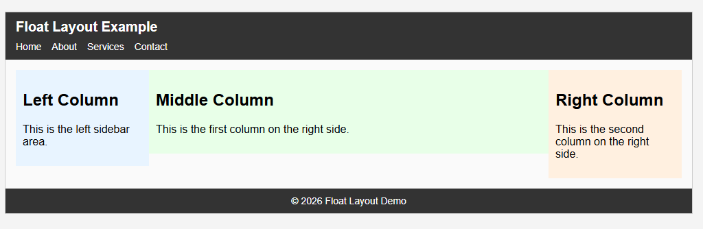

## Float Layout Demo (`index.html`)

This example shows a **very simple page layout using only CSS floats**.  
It is intended as a basic demo for students.

You can see a preview in `screenshot.png` in this folder:

- **Structure**
  - Header with a page title and a simple horizontal menu (`nav` with `ul > li > a`).
  - Main content area with **three columns**:
    - **Left column** (sidebar) on the left.
    - **Two columns on the right** (middle and right columns).
  - Footer at the bottom.

- **Layout technique**
  - All columns and header menu items use `float: left` for layout.
  - Basic widths are set for the three columns (25%, 37.5%, 37.5%).
  - A simple `.clearfix` (with `clear: both`) is used after floated elements so that parent containers wrap around them.

- **What is *not* used**
  - No `position`-based layout (no `position: absolute`, `relative`, etc.).
  - No Flexbox (`display: flex`) and no CSS Grid.

Students can inspect the HTML and CSS to see how float-based layouts work and why clearfixes are needed.

