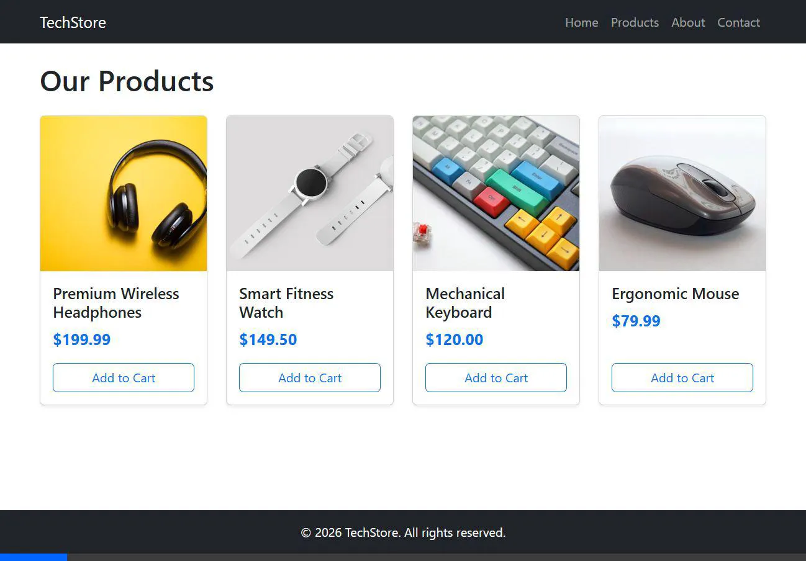

# Basic Express E-Commerce Demo



A basic e-commerce landing page and side pages built using Express, EJS templating, `express-ejs-layouts`, and Bootstrap 5. This project is specifically designed as a beginner-friendly class demonstration.

## Features

- **Express.js Backend**: A simple Express server setup handling routes.
- **MongoDB Integration**: Uses Mongoose to define a `Product` model, automatically seeds the database, and fetches products dynamically.
- **EJS Templating**: Dynamic HTML generation using EJS.
- **Layouts**: Uses `express-ejs-layouts` for a consistent header/footer across all pages.
- **Static Assets**: Serves custom CSS, client-side JavaScript, and images from a `public` directory.
- **Bootstrap 5 UI**: Clean, responsive design without writing extensive custom CSS.
- **Client-Side JavaScript**: Basic DOM manipulation and event listeners on the Products and Contact pages.

## Project Structure

```text
.
├── models/
│   └── Product.js          # Mongoose data models
├── public/
│   ├── css/
│   │   └── style.css       # Custom styles
│   ├── images/             # Local image assets
│   └── js/
│       └── main.js         # Client-side JavaScript
├── views/
│   ├── layout.ejs          # Main layout wrapper (Navbar & Footer)
│   ├── index.ejs           # Landing Page
│   ├── products.ejs        # Products Grid Page
│   ├── about.ejs           # About Us Page
│   └── contact.ejs         # Contact Form Page
├── package.json
└── server.js               # Express application entry point
```

## Prerequisites

- [Node.js](https://nodejs.org/) installed on your machine.
- [MongoDB](https://www.mongodb.com/try/download/community) installed and running locally on the default port (`27017`).

## Installation

1. Clone or download the repository.
2. Navigate to the project directory in your terminal.
3. Install the required dependencies:

```bash
npm install
```

## Running the Application

Start the server using `npm`:

```bash
npm start
```
*(Alternatively, you can run `node server.js`)*

The server will start, and you can view the application in your browser at:
**http://localhost:3000**

## Pages Included

- **`/` (Home)**: A landing page introducing the store.
- **`/products`**: Displays a grid of items. Clicking "Add to Cart" triggers a JavaScript alert.
- **`/about`**: Information about the store with an image layout.
- **`/contact`**: A functional-looking contact form. Submitting it triggers a JavaScript alert and clears the form.
