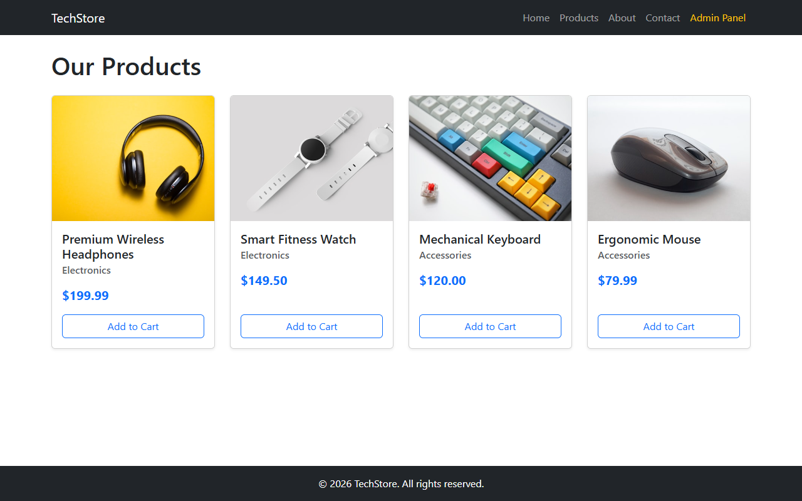
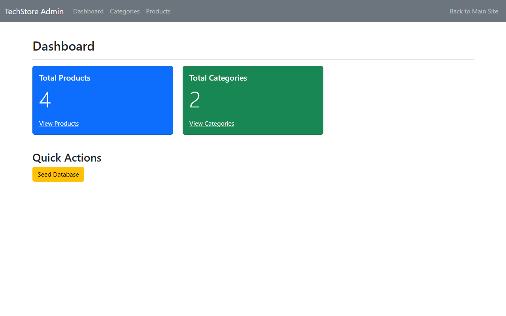

# Fullstack Express E-Commerce with Admin Panel





A comprehensive e-commerce class demonstration built using Node.js, Express, EJS templating, `express-ejs-layouts`, MongoDB (Mongoose), Multer, and Bootstrap 5. This project serves as a practical introduction to building full-stack MVC applications, featuring a user-facing store and a fully functional Admin Panel for data management.

## Features

- **Express.js Backend**: Robust server architecture handling separate public and admin routing layers.
- **MongoDB & Mongoose**: Utilizes Object Data Modeling (ODM) with interrelated `Product` and `Category` models.
- **Admin Panel (CRUD)**: A dedicated dashboard allowing administrators to Create, Read, Update, and Delete products and categories without touching code or databases directly.
- **File Uploads with Multer**: Supports dynamic product image uploads, safely storing files into the local `public/uploads` directory.
- **EJS Templating & Layouts**: Dynamic HTML generation featuring distinct layout middlewares—one for the public store and an isolated layout for the Admin Panel.
- **Bootstrap 5 UI**: Clean, responsive design implemented seamlessly.
- **Database Seeding**: Built-in 1-click feature to populate the database with default categories and products for immediate demonstration.

## Project Structure

```text
.
├── models/
│   ├── Category.js         # Mongoose schema for product categories
│   └── Product.js          # Mongoose schema for products (links to Category)
├── public/
│   ├── css/                # Custom styles
│   ├── images/             # Static placeholder images
│   ├── uploads/            # Dynamic image uploads managed by Multer
│   └── js/                 # Client-side JavaScript
├── routes/
│   └── admin.js            # Admin panel routing and logic
├── views/
│   ├── admin/
│   │   ├── categories/     # Admin views for managing categories
│   │   ├── products/       # Admin views for managing products
│   │   ├── dashboard.ejs   # Admin overview and seed controls
│   │   └── layout.ejs      # Distinct layout template for admin pages
│   ├── layout.ejs          # Main layout wrapper for the public store
│   ├── index.ejs           # Public Landing Page
│   ├── products.ejs        # Public Products Grid Page
│   ├── about.ejs           # Public About Us Page
│   └── contact.ejs         # Public Contact Form Page
├── package.json
└── server.js               # Express application entry point
```

## Prerequisites

- [Node.js](https://nodejs.org/) installed on your machine.
- [MongoDB](https://www.mongodb.com/try/download/community) installed and running locally on the default port (`27017`).

## Installation

1. Clone or download the repository.
2. Navigate to the project directory in your terminal.
3. Install the required dependencies:

```bash
npm install
```

## Running the Application

Start the server:

```bash
node server.js
```

The server will start on port 3000.

## Usage Guide

### Public Store
Visit **http://localhost:3000** to view the main store, browse products (which dynamically fetch category names and uploaded images), and explore the supplementary pages.

### Admin Panel & Seeding Data
1. Visit **http://localhost:3000/admin** to access the Admin Panel.
2. **Crucial First Step**: If your database is empty, click the **Seed Database** button on the Admin Dashboard. This action instantly populates Mongoose with default categories ("Electronics", "Accessories") and demo products, linking them automatically.
3. Use the navigation links to manage **Categories** and **Products**. 
4. When adding or editing a product, use the file upload field to browse your computer and upload a new product image via Multer.
